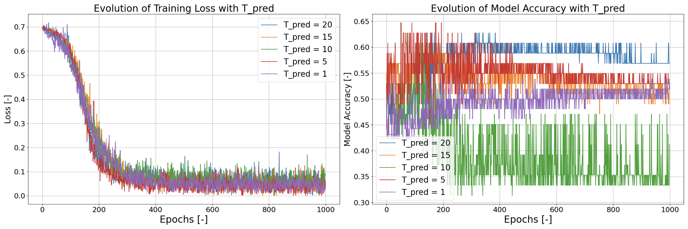

# StockConv

## Operating Principle
This project implements a method of algorithmic trading or time series prediction based on the conversion of time series data into a binary image. Based on the binary images of several share prices (or any combination of temporal trends), one can train a Convolutional Neural Network (CNN) to predict, after a certain prediction time T_{prediction}, whether the price of one of them has risen or fallen. 

The image below shows, for a single time series, how its values at adjacent time intervals t_i are extracted, and how much the sell time is separated from the last value of this time series. With this in mind, the goal of the trained CNN is to predict whether at t_{sell}, the share price has fallen (y_i = 0) or risen (y_i = 1) with respect to its value at t_{n_{series}}. The input for this prediction is not only the time series of the trend to be predicted, but also the time series of several other trends which are considered relevant, for the same time interval.


However, instead of directly inputting the values of the multiple time series under consideration, each relevant time series is converted into a binary image of known size. In simple terms, a matrix of n_{rows} x n_{cols} zeros is filled up with ones, in such a way such that the resulting temporal trend is emulated. The image below illustrates the schema of this "binarization", where cells of this matrix colored as pink are seen to contain data points of the time series being binarized.


This procedure is carried out by the following function:

```python
    def binary_image(data, n_cols, n_rows):
        """This simple function is in charge of the conversion of a time series of data into its binary image equivalent"""
        X = np.linspace(0, len(data), n_cols)
        Y = np.linspace(np.max(data), np.min(data), n_rows)
        image = np.zeros((1, 1, n_rows, n_cols))

        for t in range(len(data)):
            i = np.argmin(np.abs(X - t))
            j = np.argmin(np.abs(Y - data[t]))
            image[:, :, j, i] = 1
        return image
```

The results of this binarization are visible in the figure below, where 20 data points of a single data points are extracted in order to define a binary image, presented in the subplot to the right. In this subplot, cells colored black represent cells of the binary image containing a 1. These matrices are used as input in order to train the CNN in charge of prediction.


Thus, the input to the CNN is a 3D array, containing one binary image of size n_{rows} x n_{cols} for each of the time series/trends to be employed for the prediction of one of them. In other words, each of the trends taken into account has its own channel at the input. The output of the CNN is either 0 or 1, depending on whether the share price to be predicted has fallen or risen, respectively.

## Script Description
**LoadData.py:** This script downloads and processes all the specified stock prices. It outputs a .CSV file with the unprocessed
    price time series as well as with the time series converted binary images, with which a Convolutional NN can operate.
    
    
**trainModel.py:** This script here contains:
* Data: the class in charge of defining a PyTorch dataset based on data stored with LoadData.py
* CNN: the class defining the CNN which interprets the data in order to carry out a prognosis
* Trainer: the class which carries out the training the CNN based on the specified dataset.


**ParameterCheck.py:** This script invokes the class Trainer, in order to examine how different parameters affect the accuracy of the CNN in predicting trends.

## Results - Dataset 1
The first dataset employed in this study is made up of the following time series:
* Crude Oil Stock Price (CL=F)
* Gold Stock Price (GC=F)
* S&P 500 (^GSPC)
* NASDAQ (^IXIC)
* FTSE 100 (^FTSE)
* Treasury Yield 10 Years (^TNX)

These were extracted with a time interval of 1 day, from 2000 to 2010.

### Optimum Results
When carrying out the binarization of the dataset with n_{rows} = n_{cols} = 30, n_{series} = 20, and T_{prediction} = 20 days, the model predicted the evolution of the last time series with an accuracy of 55%. This selection of parameters was obtained by means of an intensive parametric study.

For other values of T_{prediction}, a variable directly setting how far ahead the particular trend is predicted, the trained CNN performed as is shown in the image below.



## Results - Dataset 2
The second dataset employed in this study is made up of the following share prices:
* Alphabet Inc. (GOOG)
* Microsoft Corporation (MSFT)
* Apple Inc. (AAPL)
* Amazon.com, Inc. (AMZN)
* Mastercard Inc. (MA)
* Visa Inc. (V)
* Tesla Inc. (TSLA)
* Alibaba Group Holding Ltd. (BABA)
* JD.Com Inc. (JD)
* NetEase Inc. (NTES)
* NVIDIA Corporation (NVDA)
* Zalando SE (ZLDSF)
* salesforce.com, inc. (CRM)
* Amgen, Inc. (AMGN)
* Honeywell International Inc. (HON)
* Advanced Micro Devices, Inc. (AMD)
* Kirkland Lake Gold Ltd. (KL)
* Shopify Inc. (SHOP)
* RingCentral Inc. (RNG)

These were extracted with a time interval of 5 minutes, from August the 5th to October the 3rd of 2020.

### Optimum Results
When carrying out the binarization of the dataset with n_{rows} = n_{cols} = 30, n_{series} = 30, and T_{prediction} = 15 days, the model predicted the evolution of the last time series with an accuracy of 61%. This selection of parameters was obtained by means of an intensive parametric study.
