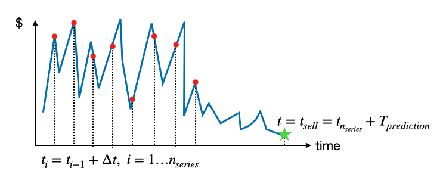
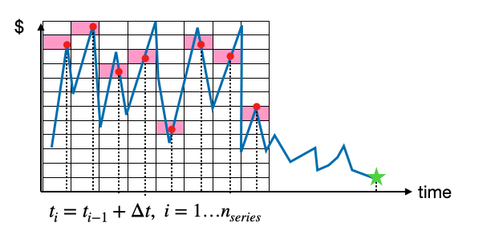
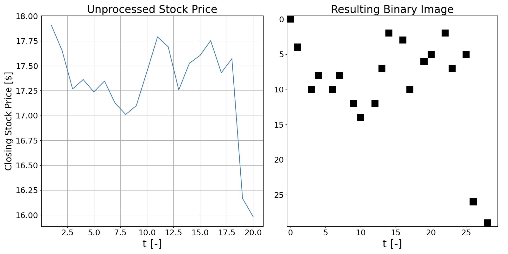

# StockConv

## Operating Principle
This project implements a method of algorithmic trading or time series prediction based on the conversion of time series data into a binary image. Based on the binary images of several share prices (or any combination of temporal trends), one can train a Convolutional Neural Network (CNN) to predict, after a certain prediction time T_{prediction}, whether the price of one of them has risen or fallen. 

The image below shows, for a single time series, how its values at adjacent time intervals t_i are extracted, and how much the sell time is separated from the last value of this time series. With this in mind, the goal of the trained CNN is to predict whether at t_{sell}, the share price has fallen or risen with respect to its value at t_{n_{series}}. The input for this prediction is not only the time series of the trend to be predicted, but also the time series of several other trends which are considered relevant.

However, instead of directly inputting the values of the multiple time series under consideration, each relevant time series is converted into a binary image of known size. In simple terms, a matrix of n_{rows} x n_{cols} zeros is filled up with ones, in such a way such that the resulting temporal trend is emulated. The image below illustrates the schema of this "binarization", where cells of this matrix colored as pink are seen to contain data points of the time series being binarized.

The results of this binarization are visible in the figure below, where 20 data points of a single data points are extracted in order to define a binary image, presented in the subplot to the right. In this subplot, cells colored black represent cells of the binary image containing a 1. These matrices are used as input in order to train the CNN in charge of prediction.

